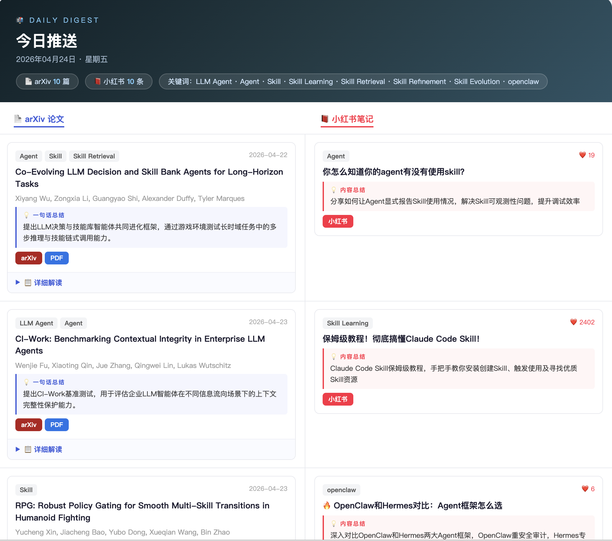

# 📬 每日推送助手

<p align="center">
  <a href="https://github.com/yzbcs/Daily-Digest-Assistant/stargazers"></a>
  <a href="https://github.com/yzbcs/Daily-Digest-Assistant/network/members"></a>
  <a href="LICENSE"></a>
  <a href="https://www.python.org/downloads/"></a>
  <a href="https://github.com/yzbcs/Daily-Digest-Assistant/actions"></a>
  <a href="#-supported-llm-providers"></a>
</p>

<p align="center">
  <b>每天中午 12 点，把最新 arXiv 论文和小红书笔记精选推进你的邮箱。</b><br/>
  LLM 智能筛选 + 中文摘要 + 详细解读，fork 即用，无需服务器。
</p>

<p align="center">
  <a href="https://yzbcs.github.io/Daily-Digest-Assistant" target="_blank"><b>🌐 在线归档站点</b></a> ·
  <a href="https://yzbcs.github.io/Daily-Digest-Assistant/archive.html" target="_blank"><b>📚 历史推送</b></a>
  <br/><small>（fork 后请把链接中的 <code>yzbcs</code> 替换为你自己的 GitHub 用户名）</small>
</p>

<p align="center">

[🇺🇸 English Version](./README_en.md)

</p>

---

## 📸 效果预览

邮件采用 **并排双栏布局**，左栏 arXiv 论文、右栏小红书笔记，一目了然：

<p align="center">
  
</p>

- **arXiv 论文**：一句话总结 + 详细解读 + PDF 链接；休息日显示"今天我们休息～"
- **小红书笔记**：内容总结 + 跳转链接；每天更新（不受 arXiv 休息日影响）

---

## ✨ 核心功能

- 🔍 **精准时间对齐**：按 arXiv 官方公告批次抓取，不漏批、不重复
- 🤖 **LLM 智能筛选**：自动从候选中精选最相关的 Top 10，低相关论文过滤不推
- 🈶 **中文双层摘要**：一句话总结 + 100-150 字详细解读，阅读效率翻倍
- 📬 **HTML 邮件推送**：精美卡片排版，**并排双栏**展示 arXiv / 小红书
- 🗂️ **在线归档站点**：自动保存每日推送到网页，支持按日期浏览历史记录
- 📕 **小红书同步推送**：每日关键词搜索 + LLM 筛选，不受 arXiv 休息日影响
- 🔄 **去重机制**：记录已推送论文，不重复推送
- 🧩 **多 LLM 支持**：Claude / MiniMax / OpenAI / DeepSeek / 智谱 / Kimi / 通义，一行配置切换
- ⚙️ **零服务器部署**：完全基于 GitHub Actions，免费自动运行

---

## 🚀 快速开始（5 分钟）

### 第一步：Fork 本仓库

点击右上角 **Fork**，将仓库复制到你的 GitHub 账号下。

### 第二步：改关键词 + 安装依赖

编辑 `config.yml`，填写你关心的关键词和分类（其他选项可以先不动）
也可以直接在 GitHub 网页上点击文件然后点编辑，无需 clone 到本地！

```yaml
keywords:
  - agent          # 关键词支持多个，只要论文命中任意一个就会进入候选
  - skill
  - your_keyword

categories:        # arxiv 分类，留空则搜全类别
  - cs.AI
  - cs.LG
```

### 第三步：配置 GitHub Secrets

进入你 fork 的仓库 → **Settings → Secrets and variables → Actions → New repository secret**，添加以下密钥：

| Secret 名称 | 说明 |
|------------|------|
| `LLM_API_KEY` | LLM 服务的 API Key |
| `EMAIL_USER` | 发件邮箱地址（163 / Gmail / QQ）|
| `EMAIL_PASS` | 发件邮箱**授权码**（非登录密码，见下方说明）|
| `EMAIL_TO` | 收件邮箱地址 |
| `XHS_COOKIE` | 小红书网页 Cookie（不填则跳过小红书推送）⚠️ Cookie 有时效，约30天需重新更新 |

### 第四步：手动触发一次验证

进入 **Actions → Daily Paper Digest → Run workflow**，手动触发一次，确认邮件正常收到。

之后每天北京时间 **12:00** 自动推送（arXiv 休息日 Fri/Sat 仍会推送小红书内容）。

> 💡 **启用归档站点（可选）**：fork 后去 **Settings → Pages → Source 选择 GitHub Actions**，你的归档站点地址为 `https://你的用户名.github.io/Daily-Digest-Assistant/archive.html`

---

## 📮 邮箱授权码获取

> 授权码 ≠ 登录密码，是专门用于第三方客户端的单独密码。

- **163 邮箱**：网页版 → 设置 → POP3/SMTP/IMAP → 开启 SMTP → 生成授权码
- **Gmail**：开启两步验证 → 安全 → 应用专用密码 → 生成
- **QQ 邮箱**：设置 → 账户 → 开启 SMTP → 获取授权码

---

## 🔧 支持的 LLM 提供商

在 `config.yml` 中修改 `llm_provider` 即可切换，填写下表中的 provider 名称：

| provider | 服务商 | 推荐理由 |
|----------|--------|---------|
| `minimax` | MiniMax M2.7 | 默认推荐，推理能力强，筛选质量高 |
| `claude` | Anthropic Claude Haiku | 速度快，输出稳定 |
| `openai` | OpenAI GPT-4o mini | 通用性好 |
| `deepseek` | DeepSeek | 国内访问快，性价比高 |
| `zhipu` | 智谱 GLM | 国内备选 |
| `moonshot` | 月之暗面 Kimi | 国内备选 |
| `qwen` | 阿里通义千问 | 国内备选 |

### 使用非内置的 LLM 服务？

如果你的 API 不在上表中，**无需改代码**，在 `config.yml` 的 `custom_llm` 中配置即可：

```yaml
llm_provider: my_api
custom_llm:
  my_api:
    sdk: openai
    base_url: "https://my-api.com/v1"
    model: "gpt-4o"
```

- `sdk`:  `"openai"`（OpenAI 兼容协议）或 `"anthropic"`（Anthropic 兼容协议）
- `base_url`: 你的 API 地址
- `model`: 模型名称

---

## ⚙️ 完整配置说明

`config.yml` 中所有可配置项：

```yaml
# 论文关键词（OR 关系，命中任意一个即进入候选）
keywords:
  - agent
  - skill
  - openclaw

# arxiv 分类过滤（留空则搜索全部分类）
# 常用分类：cs.AI cs.LG cs.RO cs.CL cs.CV
categories:
  - cs.AI
  - cs.LG
  - cs.RO

# 每日最多推送篇数
max_papers: 10

# LLM 评分门槛（1-10），低于此分的论文不推送
# 调高（如 8）→ 更严格，推送更少但更相关
# 调低（如 4）→ 更宽松，推送更多
min_score: 5

# 候选池大小：先从 arxiv 搜索这么多篇，再让 LLM 筛选
candidate_pool: 50

# 发件邮箱服务商
smtp_provider: "163"   # 可选：163 / gmail / qq

# LLM 服务商
llm_provider: minimax  # 可选：minimax / claude / openai / deepseek / zhipu / moonshot / qwen

# 自定义 LLM 提供商（使用非内置服务时填写）
custom_llm: {}
# custom_llm:
#   my_api:
#     sdk: openai
#     base_url: "https://my-api.com/v1"
#     model: "gpt-4o"

# ── 小红书配置 ───────────────────────────────────────────────
# 留空则复用上方 keywords；单独配置搜索词在此填写
xhs_keywords: []

# 小红书初始候选数量（不填默认 30）
xhs_candidate_pool: 30
```

---

## 💻 本地运行 / 测试

```bash
git clone https://github.com/yzbcs/Arxiv-Daily-Digest.git
cd Arxiv-Daily-Digest
pip install -r requirements.txt
npm install

export LLM_API_KEY="your_api_key"
export EMAIL_USER="xxx@163.com"       # 可选，163/gmail/qq
export EMAIL_PASS="your_smtp_password"
export EMAIL_TO="xxx@qq.com"          # 可选，163/gmail/qq，不要与EMAIL_USER为同一邮箱即可
export XHS_COOKIE="your_xhs_cookie"   # 可选，不填则跳过小红书

# 预览模式：不发邮件，结果保存到 preview.html
python3 main.py --dry-run

# 补跑指定日期的论文批次（小红书按今天时间搜索）
python3 main.py --dry-run --date 2026-04-03

# 正式运行（发送邮件）
python3 main.py
```

---

## 📁 项目结构

```
├── config.yml                   # ⭐ 用户配置（改这里就够了）
├── main.py                      # 主入口，串联各模块
├── fetchers/
│   ├── arxiv_fetcher.py         # arXiv 搜索 + 去重
│   ├── arxiv_schedule.py        # arXiv 公告批次时间计算
│   ├── xhs_fetcher.py           # 小红书笔记搜索
│   ├── xhs_util.py              # 小红书请求签名（JS 加密）
│   ├── xhs_pc_apis.py          # 小红书 PC 端 API
│   └── xhs_cookie_util.py      # Cookie 字符串解析
├── llm/
│   ├── filter_and_summarize.py   # arXiv LLM 筛选 + 中文摘要
│   └── filter_and_summarize_xhs.py  # 小红书 LLM 筛选
├── render/
│   └── email_renderer.py        # Jinja2 渲染 HTML 邮件
├── templates/
│   └── email.html               # 邮件模板（并排双栏布局）
├── sender/
│   └── smtp_sender.py           # SMTP 发送
├── package.json                 # Node.js 依赖（小红书签名用）
├── package-lock.json            # Node.js 依赖版本锁定
├── static/
│   ├── xhs_xs_xsc_56.js         # 小红书签名 JS（webpack bundle）
│   └── xhs_xray.js              # 小红书 xray 签名 JS
└── .github/workflows/
    └── daily.yml                # GitHub Actions 定时任务
```

---

## 📄 License

MIT © [yzbcs](https://github.com/yzbcs)
